# smallcommunity
小区水电费缴纳管理系统 亮点：人脸识别、Echarts图形化分析、腾讯地图API、支付宝沙盒支付； 角色：用户、管理员；

所有源码均本人开发，项目是前后端分离的，所有的项目都具备了完整的业务逻辑，不仅仅局限于基础的增删改查（CRUD）操作，系统亮点众多。

本文注重于计算机毕业设计选题指导，列出题目均有源码， 大家可以去【公众号】(毕业终点站)获取或者加我【qq】(2112698948)提意见(别忘记Star哟)。备注：git

声明：仅用于学习使用，请勿用于任何商业行为！

1.系统非商用，非开源，非无偿。

2.由本人开发，如需源码，请联系以下方式，qq:2112698948。

3.项目有很多，并未全部上传，如果未找到想要的，可直接咨询。

# 小区水电费缴纳管理系统

一套围绕小区居民水电费在线缴纳、楼宇与居民信息管理、地图可视化、运营数据统计构建的社区物业缴费平台。集成居民用户与管理员两角色，适合做智慧社区 / 物业缴费类毕业设计 / 课程设计。

## 系统亮点

- **人脸识别**：关键身份核验环节引入人脸识别，缴费与登录更安全便捷。
- **ECharts 图形化分析**：综合统计、费用记录统计等图表一眼看全，运营数据可视化。
- **腾讯地图 API**：小区与楼栋位置地图化呈现，居民直观查看周边资源。
- **支付宝沙盒支付**：水电费在线缴纳走支付宝沙盒，免真实资金也能跑通支付闭环。

## 技术栈

| 层次 | 技术 |
| --- | --- |
| 前端 | Vue.js + ElementUI，开发工具 VS Code |
| 后端 | Java + MyBatis-Plus + Spring Boot 框架，IDEA 2024 开发 |
| 数据库 | MySQL 5.7 / 8.0，Navicat 12 管理 |
| 架构 | B/S 架构，win10 / win11 + JDK17 运行环境 |

## 居民用户端

#### 系统封面
系统整体界面一览，功能模块清晰分区。

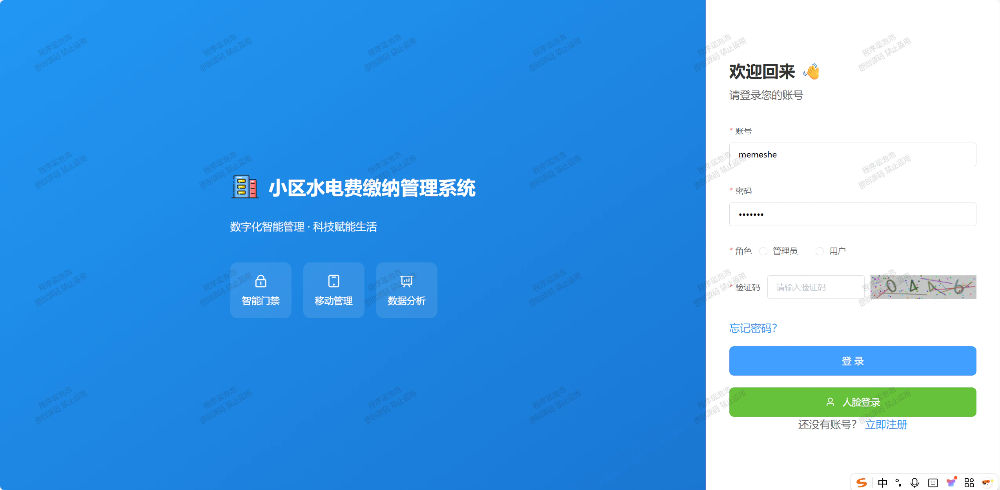

#### 首页
登录即见费用概况与快捷入口，导航直达缴费、记录等模块。

#### 小区地图 · 腾讯地图
地图化展示小区与楼栋位置，周边资源直观可查。

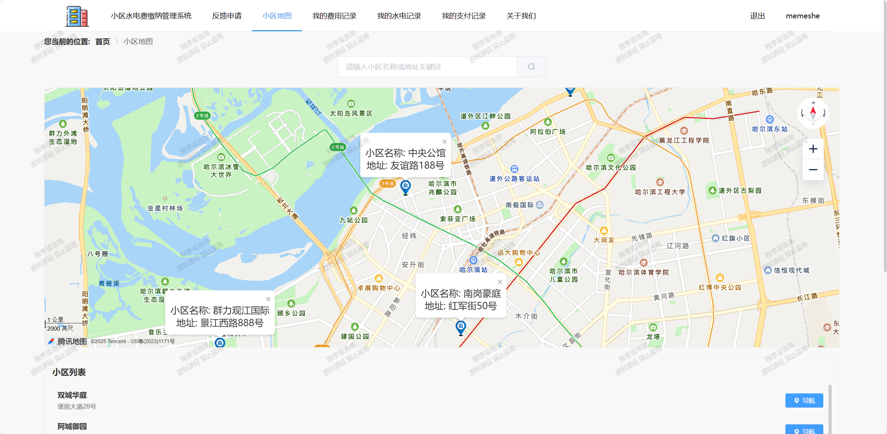

#### 费用记录
查看应缴水电费用明细，按项目与时间筛选，一键发起缴纳。

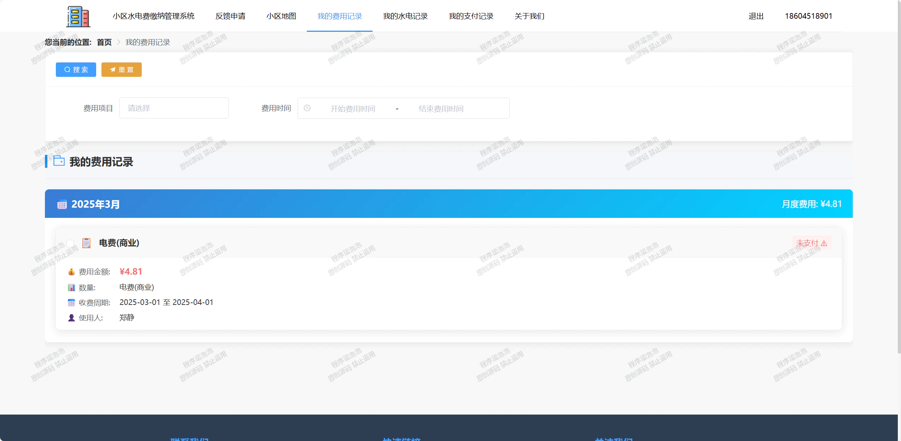

#### 支付记录 · 支付宝沙盒
每笔缴费走支付宝沙盒，支付状态与流水可查。

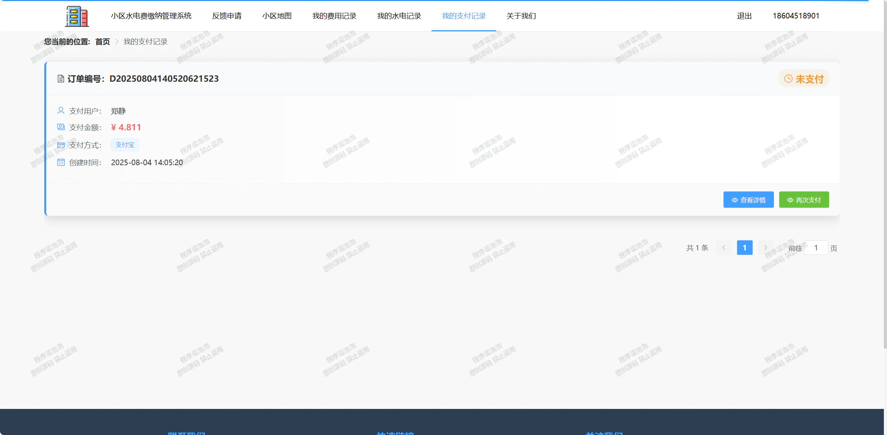

#### 水电记录
按周期查看水表、电表读数，用量变化一目了然。

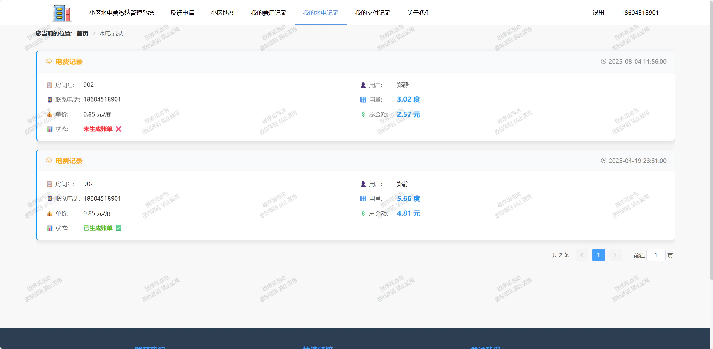

## 管理员端

#### 小区信息
维护小区基础资料与楼栋分布，资源底数清晰。

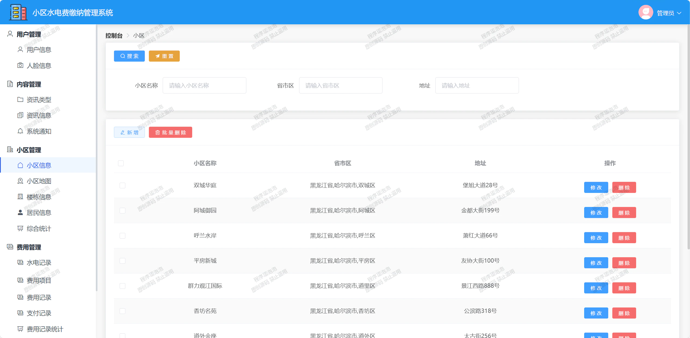

#### 居民信息
管理居民档案与所属房屋，缴费归属准确对应。

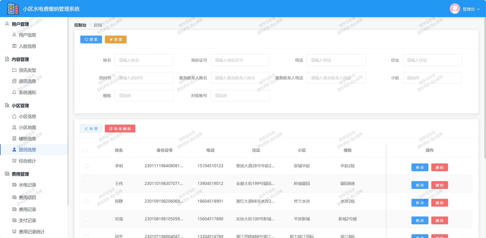

#### 综合统计 · ECharts
运营数据图形化看板，缴费率、用量趋势图表直出。

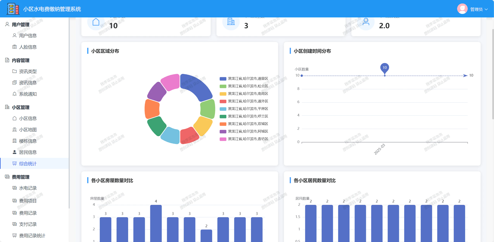

#### 费用记录统计 · ECharts
费用收支按项目、时段统计，图表辅助决策。

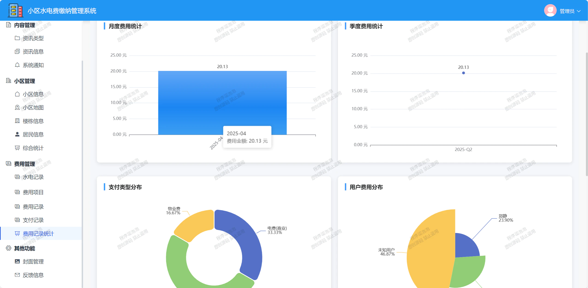

#### 支付记录 · 支付宝沙盒
后台查看全部居民支付流水，对账高效。

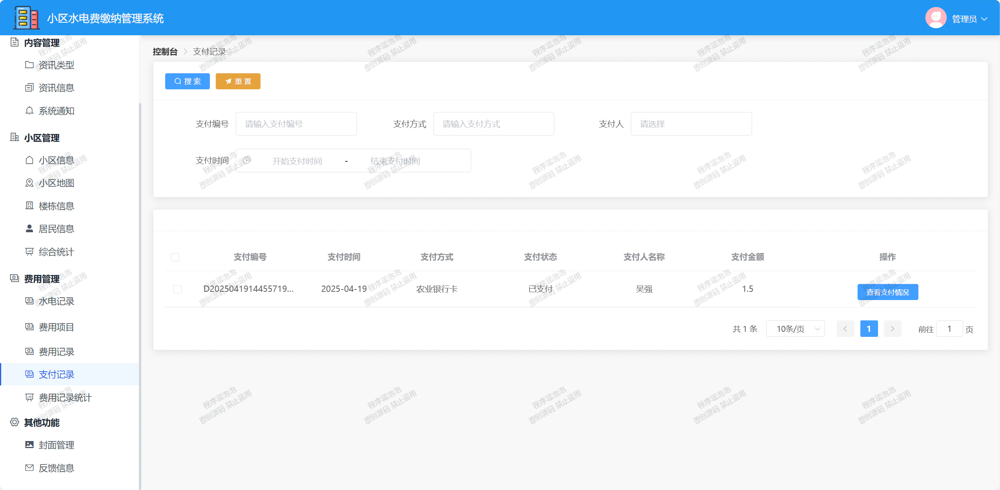

#### 数据库设计
用户、小区、楼栋、居民、水电、费用等数据表结构清晰，支撑两端业务。

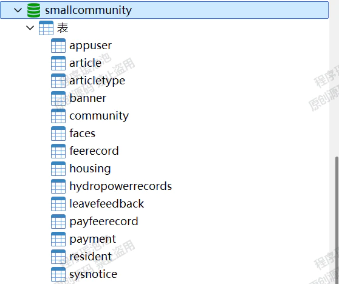

## 运行说明

1. 导入数据库脚本，创建 MySQL 库。
2. 启动 Spring Boot 后端（默认端口见配置）。
3. 前端 `npm install` 后 `npm run dev`。
4. 腾讯地图 Key、支付宝沙盒 Key 按文档配置即可联调。

文档展示 12 张截图，需要了解更多，请联系我。
